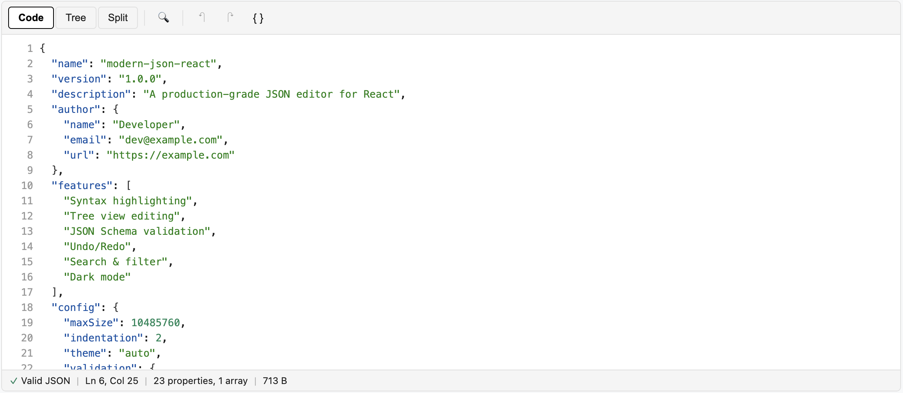
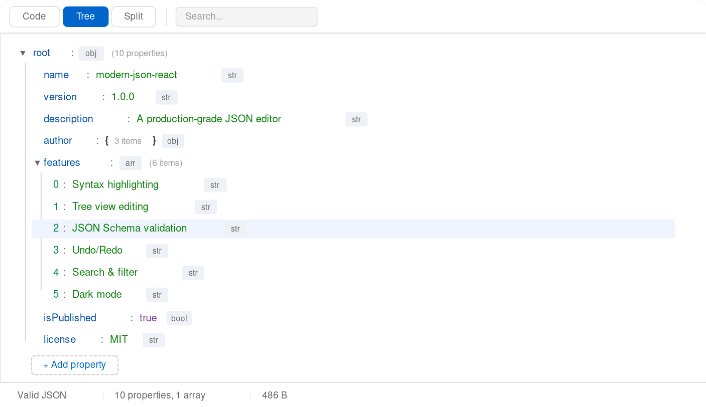
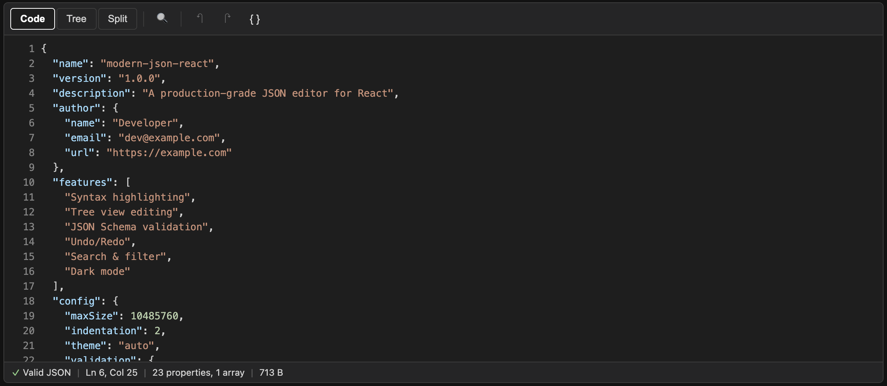

# modern-json-react

A production-grade, fully-featured JSON editor React component. Combines code editing, tree view navigation, JSON Schema validation, and accessibility-first design in a single, zero-config package.

## Screenshots

### Code Mode (Light)

Syntax-highlighted editor with line numbers, bracket matching, and real-time validation:



### Tree Mode (Light)

Collapsible tree view with inline editing, type badges, and hover actions:



### Code Mode (Dark)

Full dark theme support with VS Code-inspired color palette:



## Features

- **Dual editing modes** — Syntax-highlighted code editor, collapsible tree view, or side-by-side split mode
- **JSON Schema validation** — Built-in Draft-07 support with real-time error markers and human-readable messages
- **Tree view editing** — Inline value editing, type changing, key renaming, drag-drop reordering, and node deletion
- **Undo / Redo** — Full history stack with time-based action grouping and keyboard shortcuts
- **Search** — Full-text search across keys and values with regex support and match highlighting
- **Theming** — Light and dark presets with 22 CSS custom properties for full customization
- **Formatting** — Pretty-print, minify, sort keys (ascending, descending, or custom comparator)
- **Accessibility** — WCAG 2.1 AA compliant with full keyboard navigation, ARIA roles, and screen reader announcements
- **TypeScript** — Complete type definitions with JSDoc comments
- **Zero peer dependencies** — Only requires React 18+

## Installation

```bash
npm install modern-json-react
```

## Quick Start

```tsx
import { JsonEditor } from 'modern-json-react';

function App() {
  const [data, setData] = useState({ name: "John", age: 30 });

  return (
    <JsonEditor
      value={data}
      onChange={(value) => setData(value)}
      height={500}
    />
  );
}
```

## Props

| Prop | Type | Default | Description |
|------|------|---------|-------------|
| `value` | `unknown` | — | JSON value (object, array, string, etc.) or raw JSON string |
| `onChange` | `(value, rawText) => void` | — | Called when the JSON value changes |
| `mode` | `'code' \| 'tree' \| 'split'` | `'code'` | Active editing mode |
| `onModeChange` | `(mode) => void` | — | Called when the user switches modes |
| `schema` | `JSONSchema` | — | JSON Schema for validation (Draft-07, 2019-09, 2020-12) |
| `validators` | `CustomValidator[]` | — | Custom validation functions |
| `validationMode` | `'onChange' \| 'onBlur' \| 'onSubmit' \| 'manual'` | `'onChange'` | When to trigger validation |
| `onValidate` | `(errors) => void` | — | Called when validation completes |
| `theme` | `'light' \| 'dark' \| 'auto' \| ThemeConfig` | `'light'` | Theme preset or custom config |
| `height` | `string \| number` | `400` | Editor height (CSS value or pixels) |
| `readOnly` | `boolean` | `false` | Disable editing |
| `searchable` | `boolean` | `true` | Show search bar |
| `sortable` | `boolean` | `true` | Enable key sorting |
| `indentation` | `2 \| 4 \| 'tab'` | `2` | Indentation style |
| `lineNumbers` | `boolean` | `true` | Show line numbers in code mode |
| `className` | `string` | — | Additional CSS class |

## Schema Validation

Pass a JSON Schema to get real-time validation with inline error markers:

```tsx
const schema = {
  type: 'object',
  properties: {
    name: { type: 'string', minLength: 1 },
    age: { type: 'number', minimum: 0 },
    email: { type: 'string', format: 'email' },
  },
  required: ['name', 'email'],
};

<JsonEditor
  value={data}
  onChange={setData}
  schema={schema}
  onValidate={(errors) => console.log(errors)}
/>
```

## Custom Validators

Add your own validation rules alongside schema validation:

```tsx
const noEmptyArrays = (value, path) => {
  if (Array.isArray(value) && value.length === 0) {
    return [{ message: 'Array must not be empty', path, severity: 'warning' }];
  }
  return [];
};

<JsonEditor value={data} validators={[noEmptyArrays]} />
```

## Theming

Use a preset or provide a full custom theme:

```tsx
// Preset
<JsonEditor theme="dark" />

// Auto (follows OS preference)
<JsonEditor theme="auto" />

// Custom theme
<JsonEditor theme={{
  name: 'ocean',
  bg: '#0d1b2a',
  fg: '#e0e1dd',
  border: '#1b263b',
  keyColor: '#48cae4',
  stringColor: '#90e0ef',
  numberColor: '#ade8f4',
  // ... see ThemeConfig for all 22 properties
}} />
```

Override individual tokens with CSS custom properties:

```css
.my-editor {
  --mjr-bg: #fafafa;
  --mjr-key: #d63384;
  --mjr-string: #198754;
}
```

## Exported Utilities

The package also exports core utilities for advanced use cases:

```tsx
import {
  // Parsing
  parseJson, stringifyJson, isValidJson,

  // Validation
  validateSchema, runCustomValidators,

  // Formatting
  formatJson, minifyJson, sortJsonKeys, computeStats,

  // Path operations (immutable)
  getByPath, setByPath, deleteByPath, parsePath,

  // Hooks (for building custom editors)
  useJsonParser, useUndoRedo, useSearch,

  // Themes
  lightTheme, darkTheme,
} from 'modern-json-react';
```

## Keyboard Shortcuts

| Shortcut | Action |
|----------|--------|
| `Ctrl/Cmd + Z` | Undo |
| `Ctrl/Cmd + Shift + Z` | Redo |
| `Ctrl/Cmd + F` | Open search |
| `Escape` | Close search |
| `Tab` | Indent (code mode) |
| `Enter` | Edit selected node (tree mode) |
| `Delete` | Delete selected node (tree mode) |
| Arrow keys | Navigate tree nodes |

## Browser Support

Chrome/Edge 90+, Firefox 90+, Safari 15+. Requires React 18 or later.

## Development

```bash
# Install dependencies
npm install

# Run tests
npm test

# Type checking
npm run typecheck

# Build for production
npm run build

# Open interactive demo
open demo/index.html
```

## Project Structure

```
src/
├── index.ts                 # Public API exports
├── JsonEditor.tsx           # Root component
├── components/
│   ├── CodeEditor/          # Syntax-highlighted text editor
│   ├── TreeEditor/          # Collapsible tree with inline editing
│   ├── Toolbar/             # Mode switcher, search, actions
│   └── StatusBar/           # Validation status, cursor position, stats
├── hooks/
│   ├── useJsonParser.ts     # Parse + validate
│   ├── useUndoRedo.ts       # History management
│   └── useSearch.ts         # Search state + matching
├── core/
│   ├── parser.ts            # JSON parsing with error locations
│   ├── validator.ts         # JSON Schema validation engine
│   ├── formatter.ts         # Format, minify, sort, stats
│   └── path.ts              # JSONPath get/set/delete (immutable)
├── themes/                  # Light + dark presets
└── types/                   # TypeScript interfaces
```

## License

MIT
